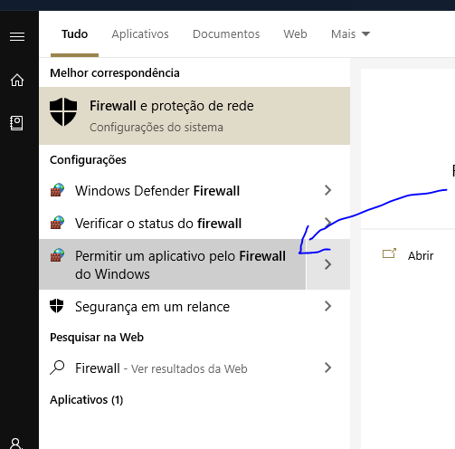
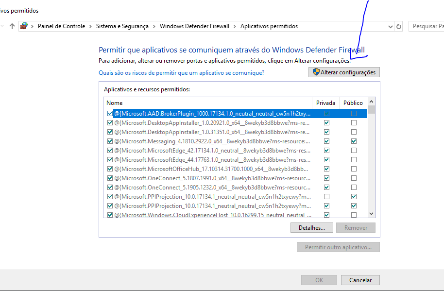
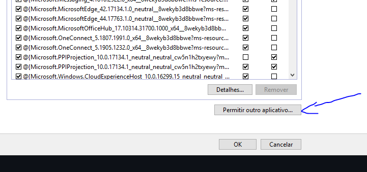
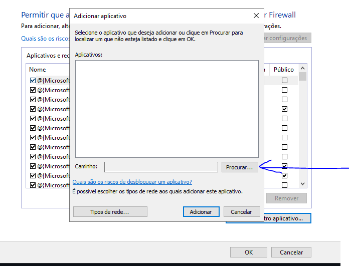
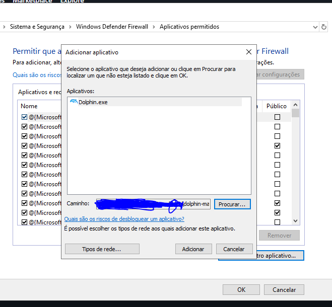
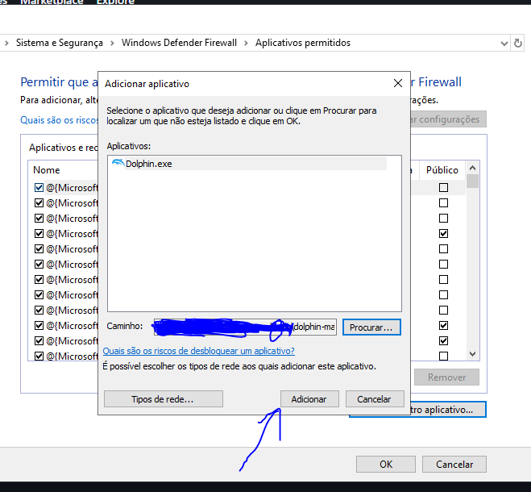

## Bem vindo

Usando o Dolphin Netplay, versão resumida

### Requisitos obrigatórios:

  * Todos (clientes e servidor) devem usar a mesma versão do Dolphin. Isso é um pré requisito do desenvolvedor;
  * A mesma ROM deverá ser utilizada para evitar problemas de compatibilidade (utilize somente cópias legalizadas);
  * Por enquanto, liberar o Dolphin no firewall do Windows foi a unica forma que eu encontrei de fazer o Netplay funcionar corretamente/sem interrupções;

### Configurando o Firewall do Windows

1 - Abrindo a configuração especifica do firewall

Acesse o menu iniciar e digite "Firewall" na busca. Selecione o item com o resultado **Permitir um aplicativo pelo Firewall do Windows**. Talvez sejam necessárias permissões de administrador

1.5 Opcional - Caso nunca tenha configurado o firewall

Na janela que for aberta, pode ser necessário clicar no botão **Alterar configurações** no canto superior direito. Clique no botão para liberar as demais configurações

2 - Adicionando o Dolphin como exceção ao firewall

Na mesma janela, clique no botão **Permitir outro aplicativo**

Na janela **Adicionar aplicativo**, clique no botão **Procurar** e procure pelo arquivo executável "Dolphin.exe" (o mesmo utilizado para abrir o emulador)

Depois de selecionar o arquivo executável, clique no botão **Adicionar**

O executável do Dolphin será adicionado a lista de exceções, porém na lista, existem as colunas **Privada** e **Pública** com as caixas de marcação. Marque a caixa da coluna **Privada** na linha do Dolphin

Clique no botão **OK** para confirmar as alterações
