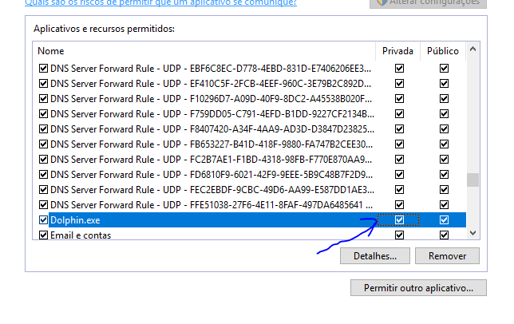
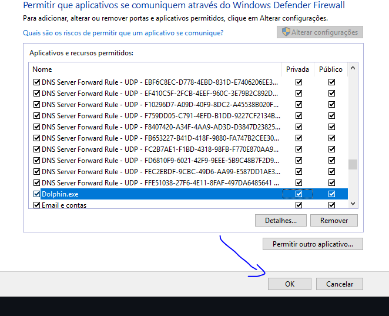
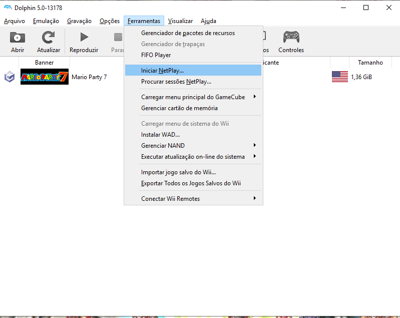
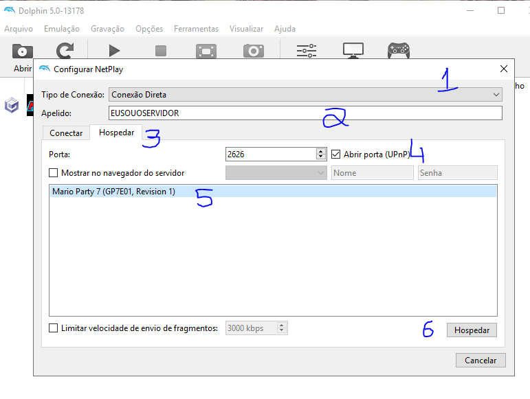
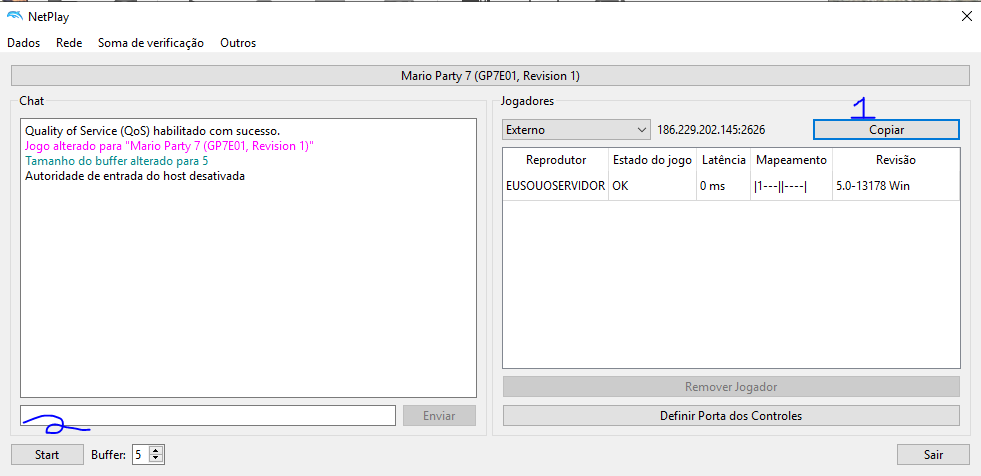
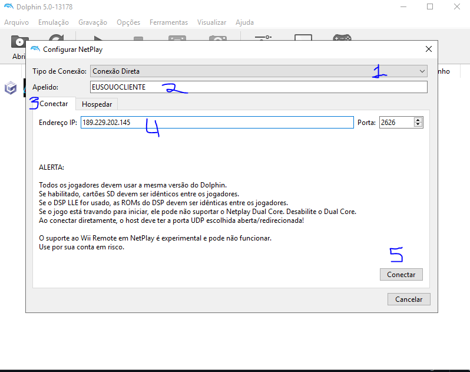

## Bem vindo

Usando o Dolphin Netplay, versão resumida

### Requisitos obrigatórios:

  * Todos (clientes e servidor) devem usar a mesma versão do Dolphin. Isso é um pré requisito do desenvolvedor;
  * A mesma ROM deverá ser utilizada para evitar problemas de compatibilidade (utilize somente cópias legalizadas);
  * Por enquanto, liberar o Dolphin no firewall do Windows foi a unica forma que eu encontrei de fazer o Netplay funcionar corretamente/sem interrupções;

### Configurando o Firewall do Windows

1 - Abrindo a configuração especifica do firewall

Acesse o menu iniciar e digite "Firewall" na busca. Selecione o item com o resultado **Permitir um aplicativo pelo Firewall do Windows**. Talvez sejam necessárias permissões de administrador

1.5 Opcional - Caso nunca tenha configurado o firewall

Na janela que for aberta, pode ser necessário clicar no botão **Alterar configurações** no canto superior direito. Clique no botão para liberar as demais configurações

2 - Adicionando o Dolphin como exceção ao firewall

Na mesma janela, clique no botão **Permitir outro aplicativo**

Na janela **Adicionar aplicativo**, clique no botão **Procurar** e procure pelo arquivo executável "Dolphin.exe" (o mesmo utilizado para abrir o emulador)

O executável aparecerá na lista de adições:

Depois de selecionar o arquivo executável, clique no botão **Adicionar**

O executável do Dolphin será adicionado a lista de exceções, porém na lista, existem as colunas **Privada** e **Pública** com as caixas de marcação. Marque a caixa da coluna **Privada** na linha do Dolphin

Clique no botão **OK** para confirmar as alterações

### Configurando o Dolphin

### Servidor (quem vai hospedar a partida)

Abra o Dolphin, e navegue até o menu **Ferramentas** > ** Iniciar NetPlay**

Na janela **Configurar Netplay** siga as instruções abaixo:

  1. No campo **Tipo de Conexão**, selecione **Conexão Direta**;
  2. No campo **Apelido** coloque um nome para que seja identificavel a sessão;
  3. Selecione a aba **Hospedar**;
  4. Mantenha a porta como **2626** e marque a caixa de seleção **Abrir porta (UPnP)**;
  5. Na lista, selecione o jogo que deseja hospedar;
  6. Clique no botão **Hospedar**;
 

A janela **NetPlay** será aberta, esse é o lobby do servidor. Todos os jogadores deverão conectar no servido nesse momento:

  1. Clique no botão **Copiar** para copiar seu endereço de IP externo e compartilhe com quem irá conectar;
  2. Somente clique no botão **Start** quando TODOS os jogadores estiverem conectados;

### Cliente (quem entrar na partida)

Abra o Dolphin, e navegue até o menu **Ferramentas** > **Iniciar NetPlay**

Na janela **Configurar Netplay** siga as instruções abaixo:

  1. No campo **Tipo de Conexão**, selecione **Conexão Direta**;
  2. No campo **Apelido** coloque um nome para que seja identificavel para o convidado;
  3. Selecione a aba **Conectar**;
  4. Coloque o endereço de IP que o servidor compartilhou com o hospedeiro, mantenha a porta como **2626**;
  5. Clique no botão **Conectar** assim que o hospedeiro abrir o lobby. Espere alguns segundos para realizar a conexão;
 

